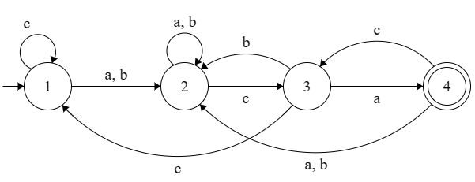
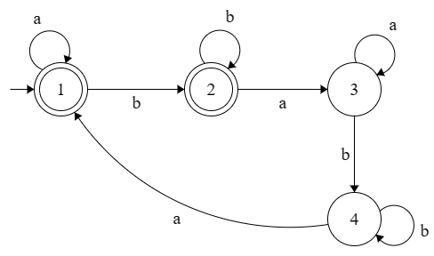
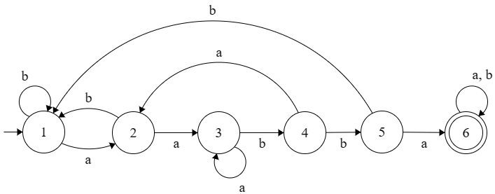
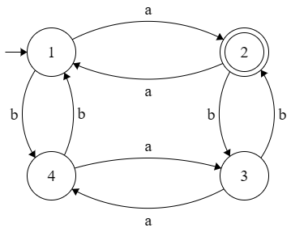
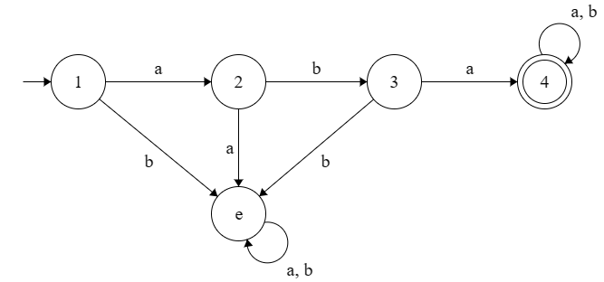

# AUTÔMATO FINITO DETERMINÍSTICO (AFD)
## Introdução

Neste trabalho, foi desenvolvida uma implementação capaz de ler um arquivo de entrada contendo as informações necessárias para definir o autômato. O arquivo de entrada contém as seguintes informações:

* Lista de estados: Os estados que compõem o AFD.
* Alfabeto: O conjunto de símbolos que podem ser utilizados como entrada.
* Transições: As regras que definem a função de transição do autômato.
* Estado inicial: O estado a partir do qual o autômato inicia a leitura das palavras.
* Estados finais: O conjunto de estados que representam o estado de aceitação do autômato.
* Palavras de teste: Um conjunto de palavras a serem testadas pelo autômato.

## Desenvolvimento

A implementação lê o arquivo de entrada e armazena as informações em estruturas de dados adequadas, como listas e mapas. Em seguida, realiza a simulação do autômato para cada palavra de teste, percorrendo as transições e atualizando o estado atual conforme os caracteres da palavra. Ao final, verifica se o estado atual está presente na lista de estados finais, determinando se a palavra é aceita ou não pelo autômato.

### Exemplo do arquivo de entrada de dados:

```plaintext
Primeira linha: os N estados;
Segunda linha: os M simbolos do alfabeto;
As proximas N linhas: sao compostas por M valores indicando as transicoes de cada um dos estados;
A proxima linha: tem o estado inicial;
A proxima linha: tem F estados finais;
A proxima linha: tem um numero T qualquer indicando o numero de palavras que serao testadas;
As proximas T linhas: contem 1 palavra cada, que devem ser validas no automato.
```

## Resultados de testes realizados

### AFD 1

- Todas as palavras do alfabeto $\Sigma = \{a, b, c\}$ que tenham o sufixo $aca$ ou $bca$.

<div align="center">

</div>

Exemplo de arquivo de entrada para a AFD 1:

```plaintext
1 2 3 4
a b c
2 2 1
2 2 3
4 2 1
2 2 3
1
4
5
aaaca
acbca
cccbca
abcabc
bbbaaa
```

Saída no terminal para o AFD 1:


### AFD 2

- Conjunto das cadeias sobre $\{a,b\}$ que contenham um número par de substrings $ba$.

<div align="center">

</div>

Exemplo de arquivo de entrada para a AFD 2:

```plaintext
1 2 3 4 e
a b 
2 e
e 3
4 e 
4 4
e e
1
4
5
abaaa
abbababa
abaabaaba
aa
abaabbb
```

Saída no terminal para o AFD 2:


### AFD 3

- Conjunto das cadeias sobre $\{a,b\}$ que contenham a substring $aabba$.

<div align="center">

</div>

Exemplo de arquivo de entrada para a AFD 3:

```plaintext
1 2 3 4
a b
2 4
1 3
4 2
3 1
1
2
5
abb
ababa
baa
bababaaba
a
```

Saída no terminal para o AFD 3:


### AFD 4

- Conjunto das cadeias sobre $\{a,b\}$ com um número ímpar de $a's$ e um número par de $b's$.

<div align="center">

</div>

Exemplo de arquivo de entrada para a AFD 4:

```plaintext
1 2 3 4
a b
1 2
3 2
3 4
1 4
1
1 2
5
bbbaba
baba
aabb
aaba
babaab
```

Saída no terminal para o AFD 4:


### AFD 5

<div align="center">

</div>

Exemplo de arquivo de entrada para a AFD 5:

```plaintext
1 2 3 4 5 6
a b
2 1
3 1
3 4
2 5
6 1
6 6
1
6
5
aabba
aaabbab
aabbabababbb
aabbba
bbaa
```

Saída no terminal para o AFD 5:


